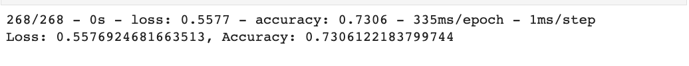
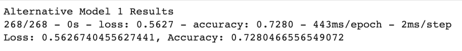
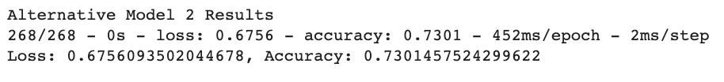

# Project Description
The following analysis consist of a venture funding with deep learning. On this project, I created a model that predicts whether applicants will be succesful if funded by Alphabet Soup. With a csv file that containn more than 34,000 organizations. I used the features in the provided dataset to create a binary classifier model that will predict whether an applicant will become a successful business. The CSV file contains a variety of information about these businesses, including whether or not they ultimately became successful.

## Instructions:

This section divides the steps for this Project, as follows:
* Step 1: Prepare the data for use on a neural network model.
* Step 2: Compile and evaluate a binary classification model using a neural network.
* Step 3: Optimize the neural network model.

# Outline
- [Part 1: Preparing the Data](#part-1-preparing-the-data)
- [Part 2: Compiling and Evaluating the Data for Use On a Neural Network Model](#part-2-compiling-and-evaluating-the-data-for-use-on-a-neural-network-model)
- [ Part 3: Optimize the neural network model](#part-3-optimize-the-neural-network-model)
- [Part 4: Conclusion](#part-4-conclusion)

# Packages and Requirements
In order to run the code make sure you are in the `dev` environment. To create a `dev` enviroment that runs python 3.7, go to your terminal and:
`conda create -n dev python=3.7 anaconda`
Once the enviroment is created just go to your terminal and type `conda activate dev` and to deactivate enviroment, `conda deactivate dev`.

# Part 1: Preparing the Data
1. I opened the csv file with the applicants data on jupyter notebook. Then, I drop the columns "EIN" and "NAME" because they were not relevant to the binary classification model. 
2. Enconded the dataset's categorical variable using `OneHotEncoder` and then placed the enconded variables into a new dataframe.
3. Created features `X` and `y`  datasets. 
4. Splited the features and target sets into training and testing datasets.
5. With scikit-learn's `StandardScaler` I scaled the features data.

# Part 2: Compiling and Evaluating the Data for Use On a Neural Network Model
Using TensorFlow, I designed a binary classification deep neural network model. Following that, I compiled and fitted the model using the binary_crossentropy loss function, the adam optimizer, and the accuracy evaluation metric. The I evaluate the model using the test data to determine the model's loss and accuracy. The following are the results: 

# Part 3: Optimize the neural network model.
The last step of my analysis was to optimize the neural network that I previously did. In order to reach a better accuracy and descrease the loss. The following were the results that I obtained trying 2 other models.

# Part 4: Conclusion
After 3 attempts of developing and optimizing the neural model. The original model still the best one. With an accuracy of roughly 73% and less epochs, which takes less time to process the rsults and the lowest loss results among the 3 models, with a loss of roughly %55.
